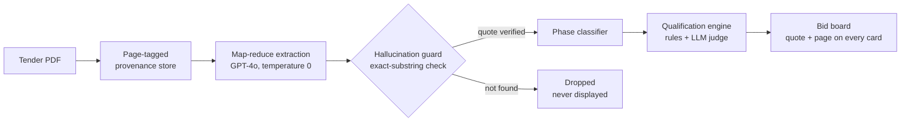

# TenderSentry

**Citation-verified compliance intelligence for Canadian public tenders.**

Under Canada's Contract A framework, one missed mandatory clause voids an otherwise winning bid. Estimators read 34–93-page tender packages under deadline pressure, and the clauses that disqualify them are often buried deep — page 75 of a 93-page RFT. TenderSentry extracts every mandatory requirement, proves each one with a verbatim quote and true page number, and tells a contractor whether they can even submit.

## The core invariant

**Every displayed requirement carries a verbatim quote and a true page number, verified by exact-substring match against the source PDF.** If the model's quote can't be found on the cited page, the requirement is repaired or dropped — never shown. No hallucinated compliance advice, ever.

## What it does

1. **Ingest** — CanadaBuys tender discovery (CSV + scraper fallback) and raw PDF ingestion with a page-tagged provenance store (pdfplumber)
2. **Extract** — map-reduce extraction over page-tagged chunks (GPT-4o, temperature 0, JSON mode)
3. **Verify** — the hallucination guard: exact-substring check of every quote against its cited page, with cross-page repair; failures are dropped
4. **Classify** — each requirement labeled bid-phase mandatory vs. contract condition vs. not-a-requirement
5. **Qualify** — hybrid engine: deterministic checks against a firm profile (certifications, bonding, insurance, regions, submission methods) plus a batched fuzzy LLM judge with judgment provenance
6. **Present** — a bid board sorted by closing date; red is reserved exclusively for bid-voiding blockers; every blocker card shows the disqualifying clause and its page



## How Codex and OpenAI models were used

The entire codebase was built through Codex working against written specs across the Build Week window. That spec-first workflow produced the extraction pipeline, hallucination guard, phase classifier, qualification engine, Streamlit UI, and accompanying test suite.

The configured OpenAI model is `gpt-4o`. It is used for map-reduce requirement extraction, phase classification, and the fuzzy qualification judge. All three call sites use temperature 0 and JSON-object response mode. Extracted requirements then pass through the hallucination guard: each verbatim quote is normalized and checked against its cited source page, cross-page repair is attempted when necessary, and any quote that still cannot be verified is dropped before classification, qualification, or display.

## Real results (demo set: 4 real Ontario/federal tenders, 34–93 pages)

| Tender | Pages | Extracted | Verified | Dropped by guard | Verdict |
|---|---|---|---|---|---|
| Federal crane rental RFSO | 55 | 98 | 92 | 6 | No bid (fax submission required) |
| Muskoka Lakes T-2026-31 | 34 | 33 | 31 | 2 | No bid (physical delivery required) |
| Augusta PW-2026-04 | 65 | 88 | 87 | 1 | No bid (physical delivery to clerk's office) |
| Kincardine CS-2025-01 | 93 | 79 | 76 | 3 | Review (33 items for human judgment) |

**12 fabricated or unverifiable requirements were caught and dropped by the guard before any human saw them.**

Buried clauses it surfaced, with citations:
- **Kincardine, page 75 of 93**: electronic bids must still hand-deliver the original bid security to the municipal office within 3 working days of the deadline
- **Muskoka, TC-2.1 (page 6)**: tender deposit accepted only as bid bond or irrevocable letter of credit — certified cheques, accepted by neighbouring municipalities, are silently excluded

## Run it

```bash
pip install -r requirements.txt
cp .env.example .env   # add your OPENAI_API_KEY
python3 -m extract.pipeline <tender_id> --force   # extraction + verification
python3 -m match.engine <tender_id> --force       # qualification
streamlit run ui/app.py
```

Tender PDFs live in `data/tenders/<tender_id>/raw/`. The firm profile is `data/profile.json`.

### What under `data/` is committed, and what regenerates

Committed, because something downstream reads it and could not rebuild it:

| Path | Why it is in git |
|---|---|
| `data/tendersentry-slim.db` | The daily refresh runs against it. A projection of the full database, rebuilt by `scripts/build_slim_db.py` after every retrain, and stamped with the source it came from. |
| `data/statcan/bcpi-*.json` | The 4 KB price-index slice the scale estimator deflates with. |
| `model/artifacts/scale-estimator.*` | The fitted estimators. Published band figures are unreproducible without them. |
| `web/data/**` | The serving artifacts the site imports statically. |

Gitignored, because each is a cache or a working file that regenerates on demand:
`data/tendersentry.db` (the full database), `data/seao/` (downloaded weekly OCDS
files), `data/model_cache/` (sentence-transformer vectors), `data/statcan/*.csv`,
`data/rankings/`, `data/census/`.

**`data/open_tender_notices.csv` was tracked and is now gitignored.**
`docs/STATE-20260830.md` §10 left this open as UNVERIFIED; it is answered. Nothing
reads it as data. Both references — `ingest/canadabuys.py:334` and
`notices/canadabuys.py:130` — pass it to `fetch_notices_csv` as a *download
destination*, and that function re-downloads whenever the file on disk is older than
24 hours (`ingest/canadabuys.py:42`). It is a download cache, exactly like
`data/seao/`. Keeping it tracked was actively harmful: the daily workflow stages only
`web/data` and the slim database, so the committed copy would have frozen at its
2026-07-29 state while the database it fed moved on — 6 MB in git disagreeing with
everything derived from it. Regenerate with
`python3 -m notices.ingest --source canadabuys`.

## Known limitations and roadmap

- The qualification engine's deterministic field set covers certifications, bonding capacity, insurance limits, regions, and submission methods. Instrument-type checks (e.g. failing a firm whose bid security is a certified cheque against a bonds-only tender) are extracted and displayed but not yet machine-checked — next increment.
- Deadline-date comparison against the current date is not yet implemented.
- Extraction precision was verified by hand on the flagship kill-shots; a full sampled precision/recall audit is the next validation step.
- One unsupported machine-check pattern (`bonding_capacity in <region>`) is downgraded to fuzzy judgment with a logged warning.

Built solo during OpenAI Build Week, July 2026.
